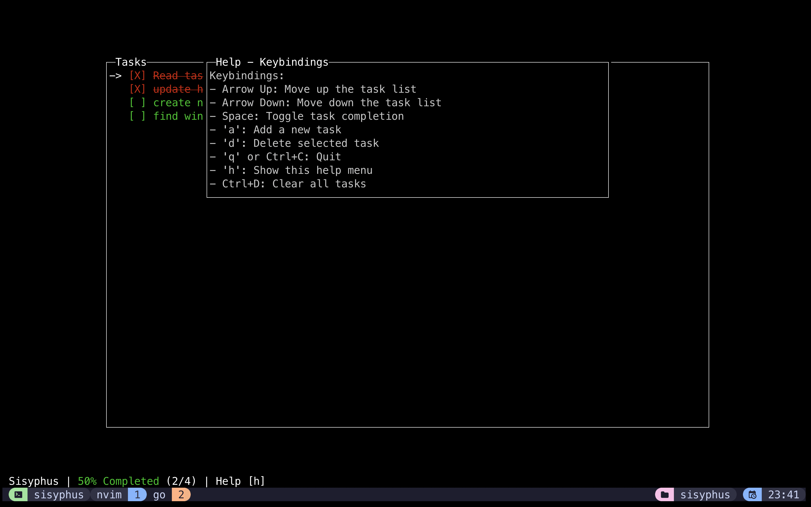

# Sisyphus

Sisyphus is a terminal-based task manager with a simple, interactive interface for managing daily, weekly, monthly, and annual goals. It helps you stay organized and track your progress without distractions.

## Libraries Used

- [gocui](https://github.com/awesome-gocui/gocui): A minimalist Go library for building terminal-based user interfaces.

## Screenshots

_sisyphus is under active development_

